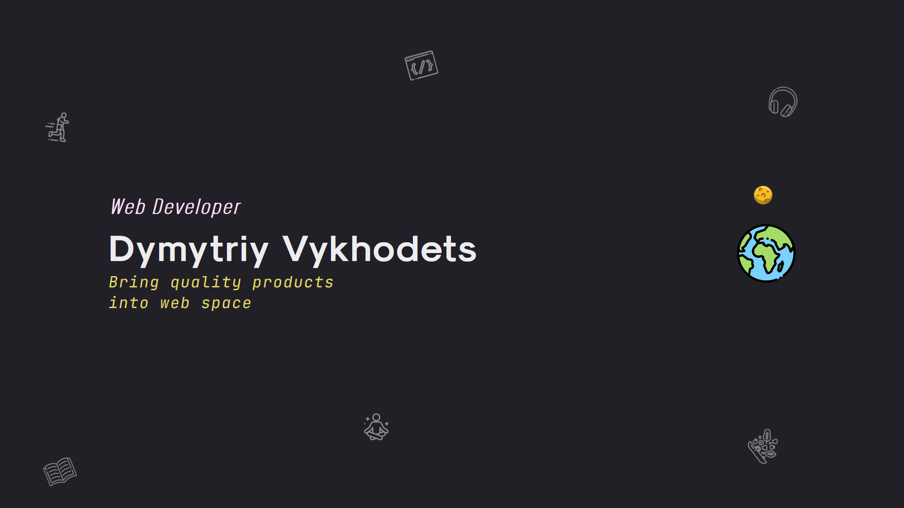

<h1 align='center'>Portfolio Website</h1>



## Deployment

Clone and install
```bash
git clone https://github.com/m1tyya/m1tyya.github.io.git portfolio
cd portfolio
yarn
```

Run a development server
```bash
yarn dev
```
